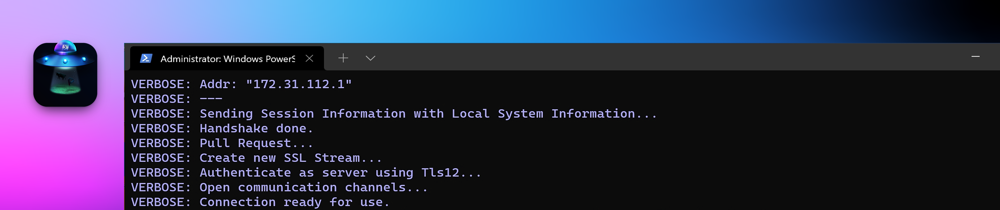
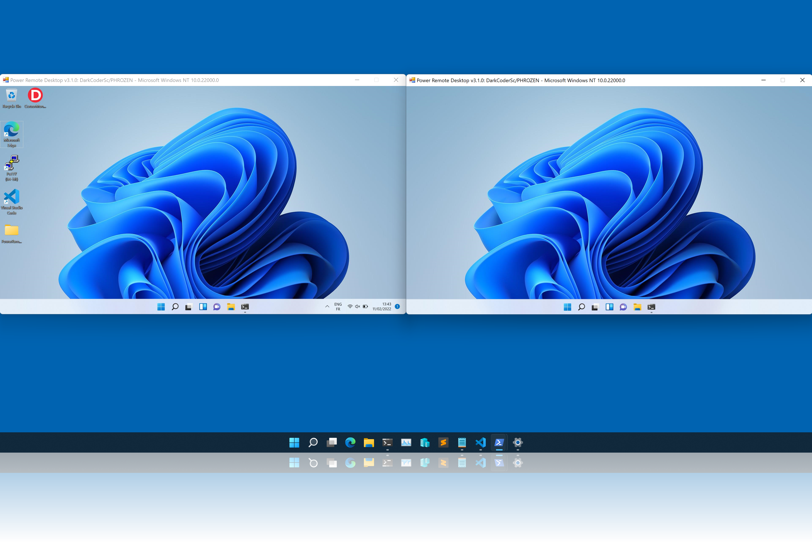
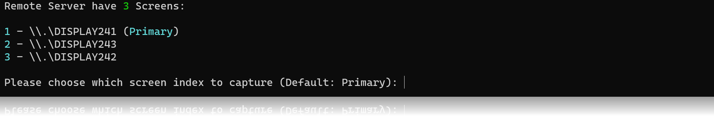
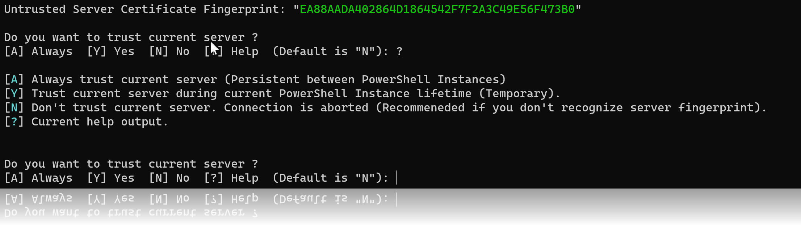

<p align="center">
  
</p>

# Power Remote Desktop



*Power Remote Desktop* is a fully functional Remote Desktop Application entirely coded in PowerShell.

It doesn't rely on any existing Remote Desktop Application or Protocol to function. A serious advantage of this application is its nature (PowerShell) and its ease of use and installation.

This project demonstrate why PowerShell contains the word *Power*. It is unfortunately often an underestimated programming language that is not only resumed to running commands or being a more fancy replacement to the old Windows command-line interpreter (cmd).

Tested on:

* **Windows 10**
* **Windows 11**

Current version: **4.0.0 Stable**

## Performance

Enjoy better streaming performance and a better experience using **PowerShell 7** instead of **PowerShell 5**.

You can install PowerShell 7 for Windows [here](https://docs.microsoft.com/fr-fr/powershell/scripting/install/installing-powershell-on-windows?view=powershell-7.2)

---

## Highlighted Features



* Remote Desktop Streaming with support of HDPI and Scaling.
* Remote Control: Mouse (Moves, Clicks, Wheel) and Key Strokes (Keyboard)
* **Secure**: Network traffic is encrypted using TLSv1.2 or 1.3. Access to server is granted via a challenge-based authentication mechanism (using user defined complex password).
* Network traffic encryption is using whether a default X509 Certificate (Requires Administrator) or your custom X509 Certificate.
* Server certificate fingerprint validation supported and optionally persistent between sessions.
* Clipboard text synchronization between Viewer and Server.
* Mouse cursor icon state is synchronized between Viewer (Virtual Desktop) and Server.
* Multi-Screen (Monitor) support. If remote computer have more than one desktop screen, you can choose which desktop screen to capture.
* View Only mode for demonstration. You can disable remote control abilities and just show your screen to remote peer.
* Session concurrency. Multiple viewers can connect to a single server at the same time.
* Prevent computer to enter in sleep mode while server is waiting for viewers.
* Only pieces of desktop that was updated are sent to viewer to increase streaming speed.

---

## Setup everything in less than a minute (Fast Setup)

````powershell
Install-Module -Name PowerRemoteDesktop_Server

Invoke-RemoteDesktopServer -CertificateFile "<certificate_location>"
````

If you are even more lazy and want to avoid using your own certificate, remove `CertificateFile` option but you will need to run PowerShell as Administrator.

````powershell
Install-Module -Name PowerRemoteDesktop_Viewer

Invoke-RemoteDesktopViewer -ServerAddress "<ip_address>" -Password "<the_one_displayed_on_server>"
````

Thats it 😉

---

## Detailed Installation and Instructions

You will find multiple ways to use this PowerShell Applications. Recommended method would be to install both Server and Viewer using the PowerShell Gallery but you can also do it manually as an installed module or imported script.

### Install as a PowerShell Module from PowerShell Gallery (**Recommended**)

You can install Power Remote Desktop from PowerShell Gallery. See PowerShell Gallery as the 'equivalent' of Aptitude for Debian or Brew for MacOS.

Run the following commands:

```powershell
Install-Module -Name PowerRemoteDesktop_Server

Install-Module -Name PowerRemoteDesktop_Viewer
```

`AllowPrerelease` is mandatory when current version is marked as a *Prerelease*

Your command prompt will show the following warning:

```
Untrusted repository
You are installing the modules from an untrusted repository. If you trust this repository, change its
InstallationPolicy value by running the Set-PSRepository cmdlet. Are you sure you want to install the modules from
'PSGallery'?
```

Answer `Y` to proceed installation.

Both modules should now be available, you can verify using the command:

```powershell
Get-Module -ListAvailable
```

Example Output:

```
PS C:\Users\Phrozen\Desktop> Get-Module -ListAvailable


    Directory: C:\Users\Phrozen\Documents\WindowsPowerShell\Modules


ModuleType Version    Name                                ExportedCommands
---------- -------    ----                                ----------------
Manifest   1.0.0      PowerRemoteDesktop_Server           Invoke-RemoteDesktopServer
Manifest   1.0.0      PowerRemoteDesktop_Viewer           Invoke-RemoteDesktopViewer

<..snip..>
```

If you don't see them, run the following commands and check back.

```powershell
Import-Module PowerRemoteDesktop_Server

Import-Module PowerRemoteDesktop_Viewer
```

### Install as a PowerShell Module (Manually / Unmanaged)

To be available, the module must first be present in a registered module path.

You can list module paths with following command:

```powershell
Write-Output $env:PSModulePath
```

Example Output:

```
C:\Users\Phrozen\Documents\WindowsPowerShell\Modules;C:\Program Files\WindowsPowerShell\Modules;C:\WINDOWS\system32\WindowsPowerShell\v1.0\Modules
```

Clone PowerRemoteDesktop repository or download a Github release package.

```
git clone https://github.com/DarkCoderSc/PowerRemoteDesktop.git
```

Copy both *PowerRemoteDesktop_Viewer* and *PowerRemoteDesktop_Server* folders to desired module path 

Example: 

```
C:\Users\<USER>\Documents\WindowsPowerShell\Modules
```

Both modules should now be available, you can verify using the command:

```powershell
Get-Module -ListAvailable
```

Example Output:

```
PS C:\Users\Phrozen\Desktop> Get-Module -ListAvailable


    Directory: C:\Users\Phrozen\Documents\WindowsPowerShell\Modules


ModuleType Version    Name                                ExportedCommands
---------- -------    ----                                ----------------
Manifest   1.0.0      PowerRemoteDesktop_Server           Invoke-RemoteDesktopServer
Manifest   1.0.0      PowerRemoteDesktop_Viewer           Invoke-RemoteDesktopViewer

<..snip..>
```

If you don't see them, run the following commands and check back.

```powershell
Import-Module PowerRemoteDesktop_Server

Import-Module PowerRemoteDesktop_Viewer
```

Notice: Manifest files are optional (`*.psd1`) and can be removed.

### As a PowerShell Script

It is not mandatory to install this application as a PowerShell module (Even if file extension is `*.psm1`)

You can also load it as a PowerShell Script. Multiple methods exists including:

Invoking Commands Using:

```powershell
IEX (Get-Content .\PowerRemoteDesktop_[Server/Viewer].psm1 -Raw)
```

Loading script from a remote location: 

```powershell
IEX (New-Object Net.WebClient).DownloadString('http://127.0.0.1/PowerRemoteDesktop_[Server/Viewer].psm1')
```

etc...

## Usage

### Client

`PowerRemoteDesktop_Viewer.psm1` needs to be imported / or installed on local machine.

#### Available Module Functions

```powershell
Invoke-RemoteDesktopViewer
Get-TrustedServers
Remove-TrustedServer
Clear-TrustedServers 
```

#### Invoke-RemoteDesktopViewer

Create a new remote desktop session with a Power Remote Desktop Server.

##### ⚙️ Supported Options:

| Parameter               | Type             | Default    | Description  |
|-------------------------|------------------|------------|--------------|
| ServerAddress           | String           | 127.0.0.1  | Remote server host/address  |
| ServerPort              | Integer          | 2801       | Remote server port |
| SecurePassword          | SecureString     | None       | SecureString object containing password used to authenticate with remote server (Recommended) |
| Password                | String           | None       | Plain-Text Password used to authenticate with remote server (Not recommended, use SecurePassword instead) |
| DisableVerbosity        | Switch           | False      | If present, program wont show verbosity messages |
| UseTLSv1_3              | Switch           | False      | If present, TLS v1.3 will be used instead of TLS v1.2 (Recommended if applicable to both systems) |
| Clipboard               | Enum             | Both       | Define clipboard synchronization mode (`Both`, `Disabled`, `Send`, `Receive`) see bellow for more detail |
| ImageCompressionQuality | Integer (0-100)  | 75         | JPEG Compression level from 0 to 100. 0 = Lowest quality, 100 = Highest quality. |
| Resize                  | Switch           | False      | If present, remote desktop will get resized accordingly with `ResizeRatio` option. |
| ResizeRatio             | Integer (30-99)  | 90         | Used with `Resize` option, define the resize ratio in percentage. |
| AlwaysOnTop             | Switch           | False      | If present, virtual desktop form will be above all other window's |
| PacketSize              | Enum             | Size9216   | Define the network packet size for streams. Choose the packet size accordingly to your network constrainsts. |
| BlockSize               | Enum             | Size64     | Define the screen grid block size. Choose the block size accordingly to remote screen size / computer constrainsts (CPU / Network) |
| LogonUI                 | Switch           | False      | Request server to open LogonUI / Winlogon desktop insead of default user desktop (Requires SYSTEM privilege in active session). |

##### Clipboard Mode Enum Properties

| Value             | Description                                        | 
|-------------------|----------------------------------------------------|
| Disabled          | Clipboard synchronization is disabled in both side |
| Receive           | Only incomming clipboard is allowed                |
| Send              | Only outgoing clipboard is allowed                 |
| Both              | Clipboard synchronization is allowed on both side  |

##### PacketSize Mode Enum Properties

| Value             | Description         | 
|-------------------|---------------------|
| Size1024          | 1024 Bytes (1KiB)   |
| Size2048          | 2048 Bytes (2KiB)   |
| Size4096          | 4096 Bytes (4KiB)   |
| Size8192          | 8192 Bytes (8KiB)   |
| Size9216          | 9216 Bytes (9KiB)   |
| Size12288         | 12288 Bytes (12KiB) |
| Size16384         | 16384 Bytes (16KiB) |

##### BlockSize Mode Enum Properties

| Value             | Description      | 
|-------------------|------------------|
| Size32            | 32x32            |
| Size64            | 64x64            |
| Size96            | 96x96            |
| Size128           | 128x128          |
| Size256           | 256x256          |
| Size512           | 512x512          |

##### ⚠️ Important Notices

Prefer using `SecurePassword` over plain-text password even if a plain-text password is getting converted to `SecureString` anyway.

#### Example

Open a new remote desktop session to `127.0.0.1:2801` with password `urCompl3xP@ssw0rd`

```powershell
Invoke-RemoteDesktopViewer -ServerAddress "127.0.0.1" -ServerPort 2801 -SecurePassword (ConvertTo-SecureString -String "urCompl3xP@ssw0rd" -AsPlainText -Force)
```

#### Enumerate Trusted Servers

When a fingerprint is met for the first time, viewer will ask you if you want to trust this new remote server fingerprint.

When you choose the `[A] Always` option, this fingerprint will be saved to local user registry. If you change your mind, you can revoke trsuted fingerprint at any time using dedicated functions.

```powershell
Get-TrustedServers
```

Example output:

````
PS C:\Users\Phrozen\Desktop\Projects\PowerRemoteDesktop> Get-TrustedServers

Detail                           Fingerprint
------                           -----------
@{FirstSeen=18/01/2022 19:40:24} D9F4637463445D6BB9F3EFBF08E06BE4C27035AF
@{FirstSeen=20/01/2022 15:52:33} 3FCBBFB37CF6A9C225F7F582F14AC4A4181BED53
@{FirstSeen=20/01/2022 16:32:14} EA88AADA402864D1864542F7F2A3C49E56F473B0
@{FirstSeen=21/01/2022 12:24:18} 3441CE337A59FC827466FC954F2530C76A3F8FE4
````

### Permanently Delete a Trusted Server

```powershell
Remove-TrustedServer -Fingerprint "<target_ingerprint>"
```

### Permanently Delete all Trusted Servers (Purge)

```powershell
Clear-TrustedServers
```

---

### Server

`PowerRemoteDesktop_Server.psm1` needs to be imported / or installed on local machine.

#### Available Module Functions

```powershell
Invoke-RemoteDesktopServer
```

##### ⚙️ Supported Options:
 
| Parameter              | Type             | Default    | Description  |
|------------------------|------------------|------------|--------------|
| ServerAddress          | String           | 0.0.0.0    | IP Address that represents the local IP address |
| ServerPort             | Integer          | 2801       | The port on which to listen for incoming connection |
| SecurePassword         | SecureString     | None       | SecureString object containing password used to authenticate remote viewer (Recommended) |
| Password               | String           | None       | Plain-Text Password used to authenticate remote viewer (Not recommended, use SecurePassword instead) |
| DisableVerbosity       | Switch           | False      | If present, program wont show verbosity messages |
| UseTLSv1_3             | Switch           | False      | If present, TLS v1.3 will be used instead of TLS v1.2 (Recommended if applicable to both systems) |
| Clipboard              | Enum             | Both       | Define clipboard synchronization mode (`Both`, `Disabled`, `Send`, `Receive`) see bellow for more detail |
| CertificateFile        | String           | None       | A file containing valid certificate information (x509), must include the **private key**  |
| EncodedCertificate     | String           | None       | A **base64** representation of the whole certificate file, must include the **private key** |
| ViewOnly               | Switch           | False      | If present, remote viewer is only allowed to view the desktop (Mouse and Keyboard are not authorized) |
| PreventComputerToSleep | Switch           | False      | If present, this option will prevent computer to enter in sleep mode while server is active and waiting for new connections. |
| CertificatePassword    | SecureString     | None       | Specify the password used to open a password-protected x509 Certificate provided by user. | 

##### Server Address Examples

| Value             | Description                                                              | 
|-------------------|--------------------------------------------------------------------------|
| 127.0.0.1         | Only listen for localhost connection (most likely for debugging purpose) |
| 0.0.0.0           | Listen on all network interfaces (Local, LAN, WAN)                       |

##### Clipboard Mode Enum Properties

| Value             | Description                                        | 
|-------------------|----------------------------------------------------|
| Disabled          | Clipboard synchronization is disabled in both side |
| Receive           | Only incomming clipboard is allowed                |
| Send              | Only outgoing clipboard is allowed                 |
| Both              | Clipboard synchronization is allowed on both side  |

##### ⚠️ Important Notices

1. Prefer using `SecurePassword` over plain-text password even if a plain-text password is getting converted to `SecureString` anyway.
2. Not specifying a custom certificate using `CertificateFile` or `EncodedCertificate` result in generating a default self-signed certificate (if not already generated) that will get installed on local machine thus requiring administrator privilege. If you want to run the server as a non-privileged account, specify your own certificate location.
3. If you don't specify a `SecurePassword` or `Password`, a random complex password will be generated and displayed on terminal (this password is temporary).

##### Examples

```powershell
Invoke-RemoteDesktopServer -ListenAddress "0.0.0.0" -ListenPort 2801 -SecurePassword (ConvertTo-SecureString -String "urCompl3xP@ssw0rd" -AsPlainText -Force)

Invoke-RemoteDesktopServer -ListenAddress "0.0.0.0" -ListenPort 2801 -SecurePassword (ConvertTo-SecureString -String "urCompl3xP@ssw0rd" -AsPlainText -Force) -CertificateFile "c:\certs\phrozen.p12"
```

#### How to capture LogonUI

Since version 4.0.0, it is possible to capture **LogonUI** / **Winlogon** (UAC Prompt, Windows Login Window, CTRL+ALT+DEL etc...).

⚠️ To be able to capture LogonUI, you must run your server under the context of **NT AUTHORITY/System** in the current active session.

Multiple methods exists to spawn a process as **SYSTEM User** under active session (Ex: PsExec, Process Hacker)

For simplicity I recommend using one of my other projects called [PowerRunAsSystem](https://github.com/DarkCoderSc/PowerRunAsSystem) 

You can install this module using your favorite method, for example with PowerShell Gallery

````powershell
Install-Module -Name PowerRunAsSystem
````

Then run bellow command as Administrator.

```powershell
Invoke-InteractiveSystemPowerShell
```

A new PowerShell terminal should appear on your desktop as **NT AUTHORITY/System**

You can now enter your Power Remote Desktop server command, future Power Remote Desktop viewer will now be able to use the option `LogonUI` to request LogonUI / Winlogon desktop on active session.

#### Generate and pass your own X509 Certificate

⚠️ Remember that not using your own X509 certificate will result in requiring administrator privilege to create a new server.

Fortunately, you can easily create your own X509 certificate for example with the help of [OpenSSL command line tool](https://www.openssl.org).

##### Generate your Certificate

```
openssl req -x509 -sha512 -nodes -days 365 -newkey rsa:4096 -keyout phrozen.key -out phrozen.crt
```

Then export the new certificate (**must include private key**).

```
openssl pkcs12 -export -out phrozen.p12 -inkey phrozen.key -in phrozen.crt
```

##### Integrate to server as a file

Use `CertificateFile`. Example: `c:\tlscert\phrozen.crt`

##### Integrate to server as a base64 representation

Encode an existing certificate using PowerShell

```powershell
[convert]::ToBase64String((Get-Content -path "c:\tlscert\phrozen.crt" -Encoding byte))
```
or on Linux / Mac systems

```
base64 -i /tmp/phrozen.p12
```

You can then pass the output base64 certificate file to parameter `EncodedCertificate` (One line)

## Changelog

### 11 January 2022 (1.0.1 Beta 2)

* Desktop images are now transported in raw bytes instead of base64 string thus slightly improving performances.
* Protocol has drastically changed. It is smoother to read and less prone to errors.
* TLS v1.3 option added (Might not be supported by some systems).
* Several code optimization, refactoring and fixes.
* Password complexity check implemented to avoid lazy passwords.
* Possibility to disable verbose.
* Server & Viewer version synchronization. Same version must be used between the two.

### 12 January 2022 (1.0.2 Beta 3)

* HDPI is completely supported.

### 12 January 2022 (1.0.3 Beta 4)

* Possibility to change desktop image quality.
* Possibility to choose which screen to capture if multiple screens (Monitors) are present on remote machine.

#### Multi Screen Selection



### 14 January 2022 (1.0.4 Beta 5)

* Password is stored as SecureString on Viewer. I don't see the point of implementing SecureString sever-side, if you do see the point, please change my mind.
* Server Fingerprint Validation. 
* Possibility to trust a server for current PowerShell Instance or persistantly using a local storage.
* Possibility to manage trusted servers (List, Remove, Remove All)

#### Fingerprint Validation



### 18 January 2022 (1.0.5 Beta 6)

* Multiple code improvements to support incoming / outgoing events.
* Global cursor state synchronization implemented (Now virtual desktop mouse cursor is the same as remote server).
* Password Generator algorithm fixed.
* Virtual keyboard `]` and `)` correctly sent and interpreted.
* Clipboard synchronization Viewer <-> Server added.
* Server support a new option to only show desktop (Mouse moves, clicks, wheel and keyboard control is disabled in this mode).

### 21 January 2022 (1.0.6)

* TransportMode option removed.
* Desktop streaming performance / speed increased.

### 28 January 2022 (2.0.0)

* Protocol was completely revisited, protocol is now more stable and modular.
* Session concurrency is now supported, multiple viewers can connect at the same time to a server.
* Possibility to stop the server using CTRL+C
* Image quality is now requested by viewer.
* Desktop resize is now made server-side.
* Desktop resize can now be forced and requested by viewer.
* Center virtual desktop glitch fixed.
* Handshake calls (auth + session / worker negociation) will now timeout to avoid possible dead locks.
* Virtual Desktop Form can now be set always on top of other forms.
* Server finally use secure string to handle password-authentication.

### 9 February 2022 (3.0.0)

* Prevent computer to sleep in server side.
* Motion Update now supported in its very first version to increase desktop streaming speed.
* Mouse move works as expected in certain circumstances.
* Keyboard simulation improved.
* Various Optimization and fixes.

### 10 February 2022 (3.1.0)

* Code refactoring and improvement.
* Desktop streaming improvement to gain few more FPS.
* Support password-protected external x509 Certificates.

### 10 March 2022 (4.0.0)

* Huge desktop streaming optimization, FPS rate increased by 65% (even more if tuning BlockSize)
* Desktop resize is now made viewer-side and automatically to simplify the code and efficiency.
* FastResize option is not required anymore.
* Various code optimization / fix.
* WIN Keyboard Key supported.
* Virtual Desktop window opens above the terminal.
* Server now support LogonUI / Winlogon (Beta)

### List of ideas and TODO

* 🟢 Mutual Authentication for SSL/TLS (Client Certificate)                
* 🟠 Interrupt sessions when local resolution has changed.
* 🔴 LogonUI Support.

🟢 = Easy
🟠 = Medium
🔴 = Hard

# Disclaimer

We are doing our best to prepare the content of this app. However, PHROZEN SASU and / or
Jean-Pierre LESUEUR cannot warranty the expressions and suggestions of the contents,
as well as its accuracy. In addition, to the extent permitted by the law, 
PHROZEN SASU and / or Jean-Pierre LESUEUR shall not be responsible for any losses
and/or damages due to the usage of the information on our app.

By using our app, you hereby consent to our disclaimer and agree to its terms.

Any links contained in our app may lead to external sites are provided for
convenience only. Any information or statements that appeared in these sites
or app are not sponsored, endorsed, or otherwise approved by PHROZEN SASU and / or
Jean-Pierre LESUEUR. For these external sites, PHROZEN SASU and / or Jean-Pierre LESUEUR
cannot be held liable for the availability of, or the content located on or through it.
Plus, any losses or damages occurred from using these contents or the internet
generally.

---

Made with ❤️ in 🇫🇷
